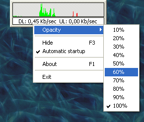



## Daniele Giabbai's Net Meter

### Description

An utility to track network usage

Features:

Network usage graph.

Actual network usage values.

Start with Windows.

Topmost window.

Configurable transparent window.

Easy redimension/move window.

Systray icon.

Visual Basic 6 source code!
 
### More Info
 

             |
---                |---
**Submitted On**   |2004-04-29 14:46:42
**By**             |[Daniele Giabbai](https://github.com/Planet-Source-Code/PSCIndex/blob/master/ByAuthor/daniele-giabbai.md)
**Level**          |Advanced
**User Rating**    |4.3 (13 globes from 3 users)
**Compatibility**  |VB 6\.0
**Category**       |[Complete Applications](https://github.com/Planet-Source-Code/PSCIndex/blob/master/ByCategory/complete-applications__1-27.md)
**World**          |[Visual Basic](https://github.com/Planet-Source-Code/PSCIndex/blob/master/ByWorld/visual-basic.md)
**Archive File**   |[Daniele\_Gi18063010162004\.zip](https://github.com/Planet-Source-Code/daniele-giabbai-daniele-giabbai-s-net-meter__1-56765/archive/master.zip)

